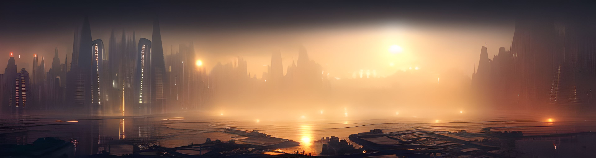

# Elsewhere: The AI Generated Metaverse

How will we build the Metaverse? With the help of Artificial Intelligence. This project aims to build a metaverse using AI.

## Welcome to Elsewhere
Elsewhere is a place beyond all places; a place so *vast* that it encompasses all known universes, muliverses and metaverses. A place generated and memorized completely by machine intelligence under the guidance of humans.

### What we are Building

## Invest
Sticking with our principle of decentralization, we are generating unique tokens as means of investing in our projects.
- [Underlords NFT Collection](https://elsewhere.network/underlords)

## Join Us

## About Us
